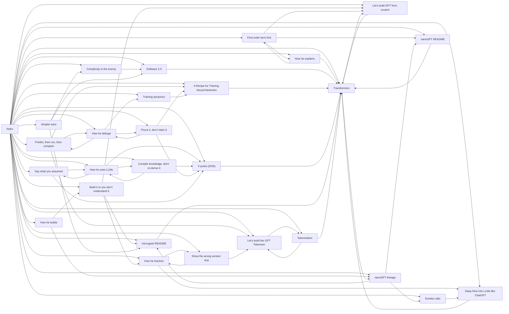

# Wiki graph (fallback view)

- pages: 28 · links: 78
- hubs: topics/transformers, sources/2026-posts-karpathy, sources/2019-11-a-recipe-for-training-neural-networks, sources/2023-01-lets-build-gpt-from-scratch, sources/2024-02-lets-build-the-gpt-tokenizer
- orphans: —
- weak rules (<2 source links): rules/say-what-you-assumed, rules/show-the-wrong-version-first